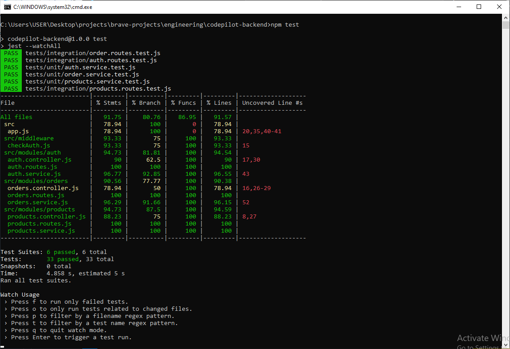
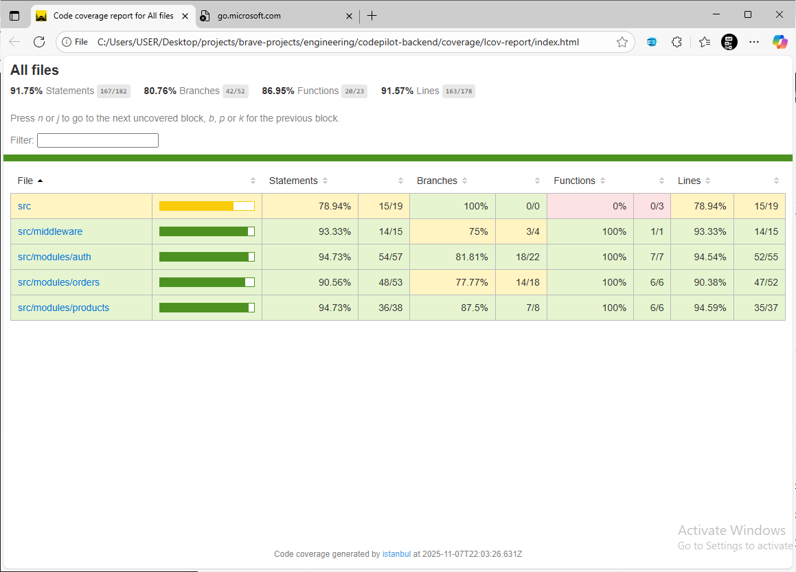

# CodePilot Backend API

Welcome to the CodePilot internal developer platform API. This service provides endpoints for managing products, orders, and authentication.

---

## 🚀 Core Features

| Feature | Status | Description |
| :--- | :---: | :--- |
| **Modular Architecture** | ✅ | Express app separated by feature (Auth, Products, Orders). |
| **Testing Strategy** | ✅ | Unit, Integration, and E2E test layers. |
| **High Coverage** | ✅ | >80% code coverage enforced by Jest. |
| **Coverage Reports** | ✅ | Generated in the `/coverage` directory. |
| **CI/CD Pipeline** | ✅ | GitHub Actions runs all tests on every push/PR. |
| **API Documentation** | ✅ | Postman collection included for all endpoints. |

---

## 🔧 Getting Started

### 1. Prerequisites

* [Node.js](https://nodejs.org/) (v18 or newer)
* [npm](https://www.npmjs.com/)

### 2. Installation & Setup

1.  **Clone the repository:**
    ```bash
    git clone https://wwww.github.com/martins0023
    cd codepilot-backend
    ```

2.  **Install dependencies:**
    ```bash
    npm install
    ```

3.  **Run in Development Mode:**
    This command starts the server with `nodemon` for hot-reloading.
    ```bash
    npm run dev
    ```
    The API will be running at `http://localhost:3001`.

### 3. Running Tests

This project is configured to run all tests and enforce coverage.

* **Run tests in watch mode (for development):**
    ```bash
    npm test
    ```

* **Run all tests and generate a coverage report (for CI):**
    ```bash
    npm run test:ci
    ```

* **View the Coverage Report:**
    After running `test:ci`, open the following file in your browser:
    ```
    /coverage/lcov-report/index.html
    ```

---

## 🧪 Testing Strategy: Coverage and Confidence

The goal of this test suite is to ensure both **broad coverage** (that our code is executed during tests) and **high confidence** (that our application works as intended in a production-like environment).

We solve the problem of "poor coverage" by *measuring* it, and we solve "unreliable confidence" by *layering* our tests.

### Our Approach: The Testing Pyramid

We use a layered "Testing Pyramid" approach to balance test speed, cost, and confidence.


---

### 1. 🥇 Unit Tests (High Speed, Low Cost)

* **What:** These test individual functions or modules (like a service) in complete isolation.
* **Where:** `tests/unit/`
* **Example:** 
    `tests/unit/products.service.test.js`
    `tests/unit/auth.service.test.js`
    `tests/unit/orders.service.test.js`
* **Why:** They are extremely fast to run, easy to write, and precisely pinpoint *what* broke (e.g., `getProductById` function). We mock all external dependencies (like databases) to keep the test "pure."
* **Confidence:** Gives us confidence that our core business logic and algorithms are correct.
* **Coverage:** This is where we get the bulk of our line and branch coverage. We test all if/else paths, error-throwing conditions, and edge cases.

---

### 2. 🥈 Integration Tests (Medium Speed, Medium Cost)

* **What:** These test how multiple units work *together*. For our API, this means testing the full request-response lifecycle for an endpoint (Route -> Controller -> Service).
* **Where:** `tests/integration/`
* **Example:** 
    `tests/integration/products.routes.test.js`
    `tests/integration/auth.routes.test.js`
    `tests/integration/orders.routes.test.js`
* **Why:** This is our most valuable layer. Using **Supertest**, we make *actual HTTP requests* to our running application (in a test environment). This validates that our modules are wired correctly, our routing works, and our data transformations are correct from start to finish.
* **Confidence:** Gives us *high confidence* that our API endpoints work as advertised. This is where we catch 80% of bugs.

---

### 3. 🥉 End-to-End (E2E) Tests (Slow Speed, High Cost)

* **What:** These test a full user *workflow* across the entire system (e.g., "User logs in, adds product to cart, and checks out").
* **Example:** "A user registers on the frontend, logs in, fetches products, adds one to a cart, and successfully checks out."
* **Why:** This is the ultimate "confidence" test, proving the whole system works.
* **Our Strategy:** 
    * Our **integration tests** for orders.routes.test.js are a form of E2E test for the backend. They test a workflow: Register -> Login (get token) -> Create Order (use token).
    * A true E2E test would also involve a tool like Cypress or Playwright to control the codepilot-frontend repository, click buttons, and verify UI changes, all while talking to this deployed backend. This is the final layer of confidence.

### How We Enforce Quality

* **Code Coverage:** We use **Jest's** built-in `--coverage` flag.
* **Coverage Gating:** Our jest.config.js file has a coverageThreshold set to 80%. If a new pull request drops the coverage below this, the build fails. This makes high coverage a non-negotiable requirement.
* **Continuous Integration (CI):**  Our GitHub Actions pipeline (.github/workflows/ci.yml) runs npm run `test:ci` on every single push and pull request. No code can be merged if the tests fail.

This multi-layered strategy gives us the best of all worlds: fast feedback from unit tests, high confidence from integration tests, and a safety net from CI and coverage gating.

### 📦 How to Run
1. **Install Dependencies:**
    ```
    npm install
    ```
2. **Run in Development Mode (with hot-reload):**
    ```
    npm run dev
    ```
    The server will run on http://localhost:3001.
3. Run Tests
    1.  **Run all tests (and watch for changes):**
        ```bash
        npm test
        ```
    2.  **Run tests for CI (generates coverage):**
        ```bash
        npm run test:ci
        ```
4.  **View Coverage Report:**
    After running `test:ci`, open `/coverage/lcov-report/index.html` in your browser.


### Output
* terminal output
    

* code coverage output
    

## 📬 API Documentation

You can find a complete list of all API endpoints, including examples and protected routes, in the Postman collection.

* **[Postman Collection](./postman_collection.json)**
    (You can import this JSON file directly into Postman)

### Example Endpoints

| Method | Endpoint | Description | Protected |
| :--- | :--- | :--- | :---: |
| `POST` | `/api/v1/auth/register` | Register a new user. | 
| `POST` | `/api/v1/auth/login` | Log in and receive a JWT. | 
| `GET` | `/api/v1/products` | Get a list of all products. | 
| `GET` | `/api/v1/products/:id` | Get a single product by its ID. | 
| `POST` | `/api/v1/orders` | Create a new order. | **Yes** |
| `GET` | `/api/v1/orders` | Get all orders for the logged-in user. | **Yes** |