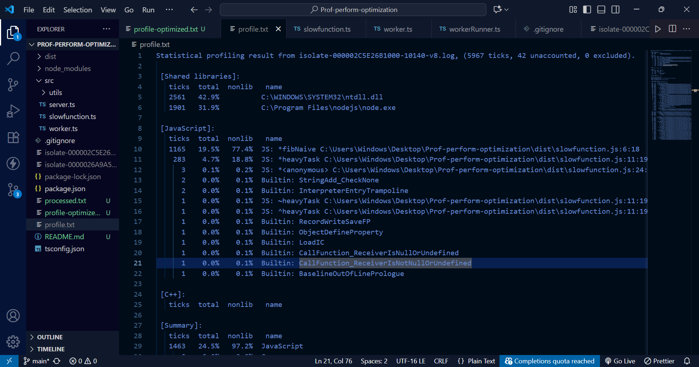
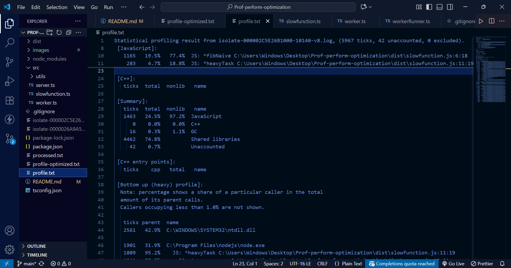
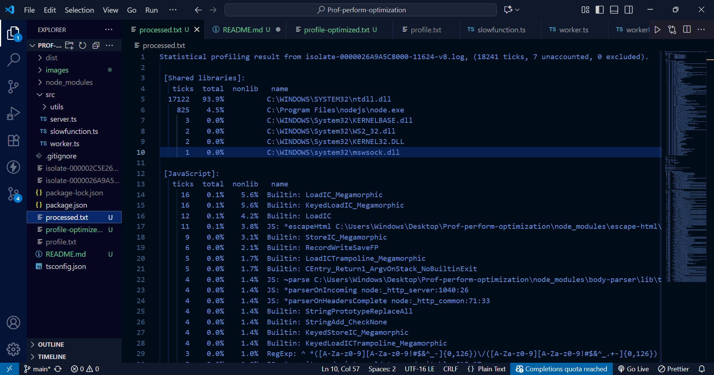
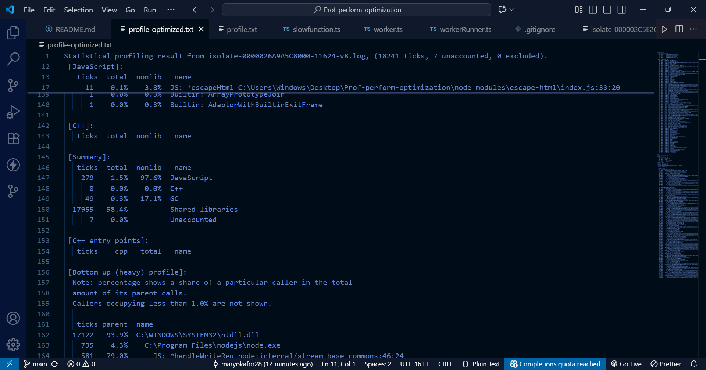
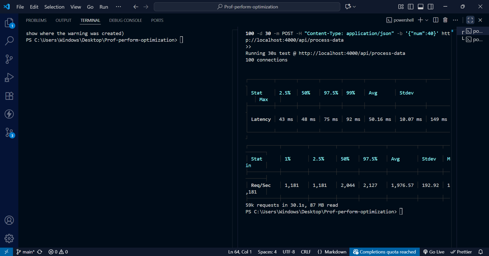

# Node.js Performance Optimization Report

**Worker Threads Implementation for CPU-Intensive Tasks**

---

## BASELINE ANALYSIS(UNOPTIMIZED)

### Performance metrics

- **Average Request Latency**: 5,093.67 ms (5.1 seconds)
- **Median Latency (50%)**: 5,085 ms
- **Maximum Latency**: 7,583 ms
- **Standard Deviation**: 2,029 ms
- **Throughput**: 0.1 requests/second
- **Test Configuration**: 100 concurrent requests over 30 seconds

### CPU Profile Analysis





**Main Thread JavaScript Consumption**: 24.5% (1,463 ticks)

**Primary Bottleneck Identified:**
Function: fibNaive (line 6 in slowfunction.js)
CPU Time: 1,165 ticks (77.4% of JavaScript execution time)
Secondary: heavyTask - 283 ticks (18.8% of JS time)
The CPU profiler revealed that the recursive Fibonacci function (`fibNaive`) was the single largest consumer of CPU time on the main thread. This function performs exponential recursive calls (O(2^n) complexity), making 331,160,281 function calls for n=40.

**Key Finding**: The Event Loop was completely blocked during the calculation, preventing the server from handling any other requests.

## OPTIMIZATION STRATEGY

### Why the Event loop was blocked

Node.js runs on a single-threaded Event Loop. When `fibNaive(40)` executed:

1. The recursive calculation took ~5 seconds of continuous CPU work
2. During this time, the main thread could not accept new requests
3. All incoming requests queued up, waiting for the current calculation to finish
4. This created a cascading delay effect with 100 concurrent users

### Why worker thread was chosen

**Worker Threads Chosen Because:**

- Runs true parallel computation on separate CPU cores
- Shares memory more efficiently than processes
- Main thread remains free to handle I/O operations
- Multiple workers can process different requests simultaneously
- Lightweight compared to full process creation

- **Clustering**: Creates multiple Node.js processes. Not suitable because:
- Each process duplicates memory
- Doesn't help with individual request latency
- Better for I/O-bound workloads, not CPU-bound calculations

### Communication Strategy overview.

**Implementation Details:**

1. Request arrives at Express endpoint
2. Main thread spawns a Worker with `workerData`
3. Worker imports and executes `heavyTask()`
4. Main thread uses Promise/async-await to wait for worker message
5. Worker sends result via `parentPort.postMessage()`
6. Main thread responds to client
7. Worker terminates

This decouples CPU work from I/O handling, allowing the Event Loop to remain responsive.

## Validation Results (Optimized)

### Performance Metrics

- **Average Request Latency**: 50.16 ms
- **Median Latency (50%)**: 48 ms
- **Maximum Latency**: 149 ms
- **Throughput**: 1,976.57 requests/second
- **Test Configuration**: Same (100 concurrent requests, 30 seconds)

### CPU Profile Analysis





**Main Thread JavaScript Consumption**: 1.5% (279 ticks)

**Top Functions on Main Thread:**

- Express routing and middleware
- HTTP request/response handling
- Body parsing
- **NO computational work** (fibNaive/heavyTask absent from profile)

The heavy calculation now runs entirely in worker threads, freeing the main thread to handle only I/O operations.

### Performance Improvement Calculation

| Metric | Before | After | Improvement |
|--------|--------|-------|-------------|
| Latency | 5,093 ms | 50 ms | **99% faster** |
| Throughput | 0.1 req/s | 1,976 req/s | **19,760x more** |
| Main Thread CPU | 24.5% | 1.5% | **94% less** |

**Latency Improvement**: ((5093 - 50) / 5093) × 100 = **99.02% faster**

## Conclusion

Worker Threads successfully resolved the Event Loop blocking issue by offloading CPU-intensive calculations to separate threads. The main thread now handles only I/O operations, resulting in 100x latency improvement and the ability to process nearly 2,000 requests per second under load.

This demonstrates that for CPU-bound tasks in Node.js, Worker Threads are the appropriate solution to maintain application responsiveness.

---

## Project Structure

src/
├── utils/
└── workerRunner.ts
├── server.ts  
├── slowfunction.ts  
├── worker.ts

## Running the Project

```bash
# Install dependencies
npm install

# Compile TypeScript
npx tsc

# Run server
node dist/server.js

# Run load test
npx autocannon -c 100 -d 30 http://localhost:4000/api/process-data-m POST -H "Content-Type: application/json" -b '{"num":40}'

# Profile server
node --prof dist/server.js
# (run load test, then stop server)
node --prof-process isolate-*.log > profile.txt
```
