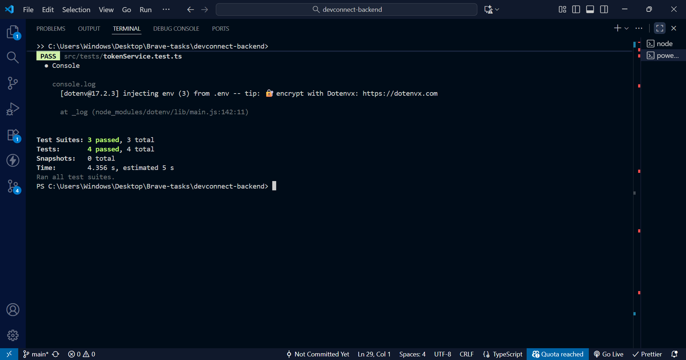

# DevConnect Backend

DevConnect is a collaborative developer networking platform that enables users to showcase projects, comment on others' work, and connect with fellow developers.  
This repository contains the **backend REST API**, built using **Node.js + Express**, with **JWT authentication**, **MongoDB**, and **cookie-based sessions**.

---

## Live API URL

🔗 **https://devconnect-backend-l07f.onrender.com**

You can test endpoints using Postman or cURL.

---

## Tech Stack

- **Node.js** + **Express.js**
- **MongoDB** + **Mongoose**
- **JWT Authentication**
- **TypeScript** (optional)
- **bcryptjs** for password hashing
- **cookie-parser** for secure cookies
- **CORS** for frontend integration
- **dotenv** for environment variables

---

## Setup Instructions

### 1️ Clone the Repository

```bash
git clone https://github.com/maryokafor28/devconnect-backend.git
cd devconnect-backend

2️ Install Dependencies
npm install

3️ Create .env File
PORT=4000
MONGO_URI=<your_mongo_connection_string>
JWT_SECRET=<your_jwt_secret>
FRONTEND_URL=https://devconnect-frontend-azure.vercel.app
NODE_ENV=production

4️ Run the Server (Development)
npm run dev

5️ Build and Start (Production)
npm run build && npm start
```

## Postman API Documentation link

**https://documenter.getpostman.com/view/48798242/2sB3QQHncg**

---

## Unit Testing (Jest)

DevConnect backend includes unit tests written with **Jest** and **Supertest** to verify API endpoint correctness and authentication flow.

---

### Run Tests Locally

npm test

### Test Results screenshot:



---

## Folder Structure

src/
├── controllers/
│ ├── authController.ts
│ ├── userController.ts
│ ├── projectController.ts
│ └── commentController.ts
├── routes/
│ ├── authRoutes.ts
│ ├── userRoutes.ts
│ ├── projectRoutes.ts
│ └── commentRoutes.ts
├── middlewares/
│ └── authMiddleware.ts
├── models/
│ ├── User.ts
│ ├── Project.ts
│ └── Comment.ts
├── utils/
│ └── generateToken.ts
│ └── validation.ts
├── server.ts
└── app.ts

## Deployment

Platform: Render.com

Database: MongoDB Atlas

Frontend: Deployed separately on Vercel

```

```
