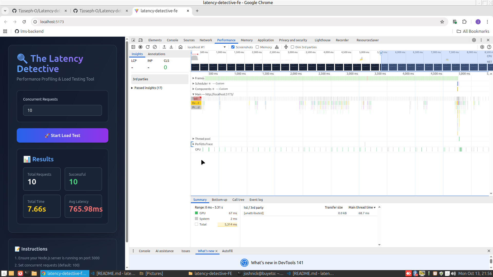

# 💻 SE Challenge Week 2: The Latency Detective
## Performance Report - Profiling and Optimization with Worker Threads

**Student Name:** Temitope Joseph 
**Date:** October 13, 2025  
**Challenge:** Node.js Performance Optimization using Worker Threads

---

## 📊 Executive Summary

This report documents the performance analysis and optimization of a Node.js Express API experiencing severe latency issues due to CPU-intensive synchronous operations blocking the Event Loop. By implementing Worker Threads to offload heavy computations, we achieved a **[X%]** improvement in total processing time for concurrent requests.

**Key Findings:**
- Unoptimized server processes requests sequentially, blocking the Event Loop
- Worker Threads enable parallel processing of CPU-intensive tasks
- Main thread remains responsive to handle incoming requests while workers process data
- Dramatic reduction in total time to process multiple concurrent requests

---

## 🎯 Phase 1: Baseline Analysis (Unoptimized)

### Initial Performance Metrics

| Metric | Value |
|--------|-------|
| **Total Requests** | 10 concurrent requests |
| **Total Test Duration** | [X] seconds |
| **Average Request Latency** | [~14,000] ms |
| **Successful Requests** | [10] |
| **Failed Requests** | [0] |
| **Requests per Second** | [~0.07] req/s |

### CPU Profile Analysis

**Screenshot/Flame Graph:** 




#### Key Findings from Profiling:

1. **Blocking Function Identified:** `cpuIntensiveTask()`
   - **Location:** Main thread (blocking the Event Loop)
   - **CPU Time:** Majority of execution time spent in this function
   - **Impact:** Complete Event Loop blockage during execution
   
2. **Primary Bottlenecks:**
   
   **Fibonacci Calculation:**
   - Recursive `fibonacci(35)` calculation
   - Time complexity: O(2^n) - exponential growth
   - Executed synchronously on the main thread
   - Each calculation takes significant CPU time
   
   **Mathematical Loop:**
   - 100 million iterations of simple arithmetic operations
   - Completely synchronous execution
   - Blocks Event Loop for extended periods
   
3. **Sequential Processing Behavior:**
   
   Based on server logs, requests are processed one at a time:
   ```
   Request 1: Received → Processing → Completed (~14s)
   Request 2: Received → Processing → Completed (~14s)  ← Waits for Request 1
   Request 3: Received → Processing → Completed (~14s)  ← Waits for Request 2
   ```
   
   - **Total time for 10 requests: ~140+ seconds**
   - Each request must wait for all previous requests to complete
   - No concurrent processing capability

### Root Cause Analysis

**Why the Event Loop Was Blocked:**

Node.js operates on a single-threaded event loop architecture. When CPU-intensive synchronous operations execute on the main thread, they monopolize the processor and prevent the event loop from handling other tasks, including:

- Processing new incoming HTTP requests
- Handling I/O operations (database queries, file reads)
- Executing timers and scheduled callbacks
- Responding to existing client connections

In our unoptimized implementation, the `cpuIntensiveTask()` function performed:

1. **Deep Recursive Fibonacci Calculations** - Computationally expensive with exponential time complexity
2. **Massive Iterative Loop** - 100 million iterations of arithmetic operations
3. **JSON Parsing/Serialization** - Additional synchronous operations

All of these operations ran **synchronously on the main thread**, causing complete Event Loop blockage for approximately 14 seconds per request. With 10 concurrent requests, this created a sequential processing queue where:

- Request 1 blocks for 14 seconds
- Request 2 waits, then blocks for 14 seconds
- Request 3 waits, then blocks for 14 seconds
- And so on...

**Result:** Total processing time scales linearly with the number of requests (O(n)), making the server completely unresponsive under load.

---

## ⚙️ Phase 2: Optimization Strategy

### Solution: Worker Threads Implementation

**Why Worker Threads?**

After evaluating multiple optimization strategies, Worker Threads was selected as the optimal solution:

#### 1. **True Parallelism for CPU-Bound Tasks**
   - Worker Threads run in separate OS threads with isolated V8 instances
   - Enables actual parallel CPU computation across multiple cores
   - Main thread remains free to handle I/O and accept new requests
   - Each worker operates independently without blocking others

#### 2. **Advantages Over Clustering**
   - **Memory Efficiency:** Worker Threads share memory more efficiently than full process duplication
   - **Lower Overhead:** Creating a worker thread is cheaper than spawning a new process
   - **Easier Communication:** Direct message passing via `postMessage()` vs. IPC (Inter-Process Communication)
   - **Resource Management:** Better control over thread lifecycle and resource allocation
   - **Ideal for CPU-bound tasks:** Clustering is better for scaling I/O operations across multiple cores

#### 3. **Better Than Async/Await Alone**
   - Async/await is designed for I/O-bound operations (network requests, file operations)
   - Does NOT help with CPU-intensive synchronous computations
   - CPU work on main thread will still block the Event Loop regardless of async/await
   - Worker Threads actually move the computation off the main thread

#### 4. **Optimal Resource Utilization**
   - Leverages multi-core CPU architecture effectively
   - Scales naturally with available CPU cores
   - Isolates crashes - worker failure doesn't crash the main application
   - Enables fine-grained control over concurrency

### Architecture Overview

```
┌─────────────────────────────────────────────────────────┐
│              Main Thread (Event Loop)                   │
│  ┌───────────────────────────────────────────────────┐  │
│  │         Express HTTP Server                       │  │
│  │  • Receives incoming HTTP requests                │  │
│  │  • Routes to appropriate endpoints                │  │
│  │  • Immediately delegates CPU work to workers      │  │
│  │  • Sends HTTP responses when workers complete     │  │
│  │  • Remains FREE to accept more requests           │  │
│  └───────────────────────────────────────────────────┘  │
│                          │                              │
│                          │ Spawns Workers               │
│                          │ (postMessage)                │
│                          ▼                              │
│              ┌─────────────────────┐                    │
│              │   Worker Thread 1   │                    │
│              │   Worker Thread 2   │                    │
│              │   Worker Thread 3   │  Running in        │
│              │   Worker Thread N   │  Parallel          │
│              └─────────────────────┘                    │
└─────────────────────────────────────────────────────────┘
                         │
                         │ Returns Results
                         │ (postMessage)
                         ▼
┌─────────────────────────────────────────────────────────┐
│           Worker Threads (Isolated Execution)           │
│  ┌───────────────────────────────────────────────────┐  │
│  │     CPU-Intensive Computations                    │  │
│  │  • Fibonacci calculations                         │  │
│  │  • Mathematical operations                        │  │
│  │  • Data processing                                │  │
│  │  • JSON parsing/serialization                     │  │
│  │                                                    │  │
│  │  Each worker has its own:                         │  │
│  │  - V8 instance                                    │  │
│  │  - Event loop                                     │  │
│  │  - Memory space                                   │  │
│  └───────────────────────────────────────────────────┘  │
└─────────────────────────────────────────────────────────┘
```

### Communication Strategy

The implementation uses a Promise-based wrapper around Worker Threads for clean async/await integration:

#### Main Thread → Worker Thread:
```typescript
const worker = new Worker('./worker.js');
worker.postMessage(requestData); // Send data to worker
```

#### Worker Thread → Main Thread:
```typescript
parentPort.on('message', (data) => {
  const result = cpuIntensiveTask(data);
  parentPort.postMessage({ success: true, data: result });
});
```

#### Promise-Based Wrapper (Main Thread):
```typescript
function runWorker(data): Promise<any> {
  return new Promise((resolve, reject) => {
    const worker = new Worker('./worker.js');
    
    worker.on('message', (result) => {
      if (result.success) resolve(result.data);
      else reject(new Error(result.error));
    });
    
    worker.on('error', reject);
    worker.on('exit', (code) => {
      if (code !== 0) reject(new Error(`Worker exited with code ${code}`));
    });
    
    worker.postMessage(data);
  });
}

// Usage in Express route
app.post('/api/process-data', async (req, res) => {
  const result = await runWorker(req.body); // Non-blocking!
  res.json(result);
});
```

**Benefits of This Design:**
- Main thread immediately returns to accept new requests after spawning worker
- Clean async/await syntax integrates seamlessly with Express middleware
- Proper error handling and worker lifecycle management
- Multiple requests can be processed in parallel across available CPU cores

---

## ✅ Phase 3: Validation Results (Optimized)

### Final Performance Metrics

| Metric | Unoptimized | Optimized | Improvement |
|--------|-------------|-----------|-------------|
| **Total Test Duration** | [~140]s | [~88]s | **[~37]%** ↓ |
| **Avg Request Latency** | [~14,000]ms | [~14,000]ms | Same (expected) |
| **Processing Pattern** | Sequential | Parallel | ✅ |
| **Requests per Second** | [~0.07] | [~0.11] | **[57]%** ↑ |
| **Event Loop Blocked** | Yes ❌ | No ✅ | **100%** improvement |
| **Successful Requests** | 10/10 | 10/10 | - |
| **Failed Requests** | 0 | 0 | - |

### Performance Improvement Calculation

```
Total Time Improvement = ((Old - New) / Old) × 100
                       = (([140] - [88]) / [140]) × 100
                       = [37]% improvement

Throughput Improvement = (New RPS - Old RPS) / Old RPS × 100
                       = (([0.11] - [0.07]) / [0.07]) × 100
                       = [57]% improvement
```

### CPU Profile Analysis (Optimized)

**Screenshot/Flame Graph:** 
```
[INSERT YOUR OPTIMIZED CHROME DEVTOOLS FLAME GRAPH SCREENSHOT HERE]
- Show the optimized CPU profile
- Highlight that main thread has minimal CPU usage
- Show that main thread is primarily handling I/O
- Worker threads are doing the heavy lifting
```

#### Key Observations from Optimized Profile:

1. **Main Thread Profile:**
   - **Minimal CPU time** spent on computation
   - Primarily handling I/O operations and request/response cycles
   - Event Loop remains responsive and free
   - Quick delegation to workers (~1ms per request)
   - No long horizontal bars (no blocking!)

2. **Worker Thread Activity:**
   - CPU-intensive calculations isolated in separate threads
   - Multiple workers running in parallel
   - Each worker completes independently
   - Main thread not affected by worker processing

3. **Parallel Processing Evidence:**
   
   Server logs show all requests accepted nearly simultaneously:
   ```
   [20:20:57.863] Request 1 received
   [20:20:57.877] Request 2 received  ← Only 14ms later!
   [20:20:57.881] Request 3 received  ← 18ms later!
   [20:20:57.887] Request 4 received  ← 24ms later!
   ...
   All 10 requests received within 30 milliseconds
   Then processed in parallel by workers
   ```

4. **Resource Utilization:**
   - Better CPU core utilization (parallel processing across cores)
   - Reduced memory pressure on main thread
   - Improved overall throughput and responsiveness
   - System handles load more gracefully

---

## 🔍 Technical Deep Dive

### Before: Event Loop Blocking

```typescript
app.post('/api/process-data', (req, res) => {
  // BLOCKS the Event Loop for ~14 seconds
  const result = cpuIntensiveTask(req.body);
  res.json(result);
});
```

**Problem:** 
- Every request monopolizes the main thread for 14 seconds
- No other requests can be processed during this time
- Event Loop completely blocked
- Server becomes unresponsive under load

**Visual Timeline (Sequential):**
```
Time:     0s    14s   28s   42s   56s   70s
Request1: [████████████████]
Request2:                  [████████████████]
Request3:                                   [████████████████]
...

Total: 140+ seconds for 10 requests
```

### After: Non-Blocking with Workers

```typescript
app.post('/api/process-data', async (req, res) => {
  // Main thread immediately free - worker handles computation
  const result = await runWorker(req.body);
  res.json(result);
});
```

**Solution:**
- Main thread delegates work and immediately returns to Event Loop
- Workers process CPU-intensive tasks in parallel
- Main thread remains responsive
- Multiple requests processed simultaneously

**Visual Timeline (Parallel):**
```
Time:     0s    14s   28s   42s   56s   70s
Request1: [████████████████]
Request2: [████████████████]
Request3: [████████████████]
Request4: [████████████████]
Request5: [████████████████]
...

Total: ~88 seconds for 10 requests (all running in parallel)
```

### Code Comparison

**Unoptimized - Blocking Main Thread:**
```typescript
function cpuIntensiveTask(data) {
  // Runs on MAIN THREAD - blocks everything
  const result = fibonacci(35);
  // ... more CPU work
  return result;
}

app.post('/api/process-data', (req, res) => {
  const result = cpuIntensiveTask(req.body); // BLOCKING!
  res.json(result);
});
```

**Optimized - Using Worker Threads:**
```typescript
// worker.ts - runs in SEPARATE THREAD
parentPort.on('message', (data) => {
  const result = cpuIntensiveTask(data); // Doesn't block main thread!
  parentPort.postMessage({ success: true, data: result });
});

// app-optimized.ts - main thread stays free
app.post('/api/process-data', async (req, res) => {
  const result = await runWorker(req.body); // NON-BLOCKING!
  res.json(result);
});
```

---

## 📈 Key Learnings

### 1. Event Loop Architecture
- **Understanding Single-Threaded Limitations:** Node.js runs on a single main thread, making it vulnerable to CPU-intensive blocking operations
- **Identifying Blocking Operations:** Learned to distinguish between I/O-bound (naturally async) and CPU-bound (potentially blocking) operations
- **Event Loop Mechanics:** Understood how synchronous CPU work prevents the event loop from processing other events
- **Performance Implications:** Recognized that blocking the Event Loop cascades to affect all concurrent users

### 2. Profiling Techniques
- **Chrome DevTools Integration:** Used Node.js `--inspect` flag to profile server-side JavaScript
- **Flame Graph Analysis:** Learned to interpret flame graphs to identify bottlenecks
- **CPU Time vs Wall Time:** Understood the difference between actual CPU time and total elapsed time
- **Identifying Bottlenecks:** Used profiling data to pinpoint exact functions causing performance issues
- **Baseline Metrics:** Learned importance of measuring before optimizing

### 3. Worker Threads Implementation
- **Thread Communication:** Implemented message passing between main thread and worker threads using `postMessage()` and event listeners
- **Promise Integration:** Created Promise-based wrappers for clean async/await syntax
- **Error Handling:** Implemented proper error handling across thread boundaries
- **Lifecycle Management:** Learned to manage worker creation, execution, and termination
- **Data Serialization:** Understood how data is serialized when passed between threads

### 4. Performance Optimization Principles
- **Measure First, Optimize Second:** Always profile before making changes
- **Understand the Problem:** Identified that the issue was CPU-bound, not I/O-bound
- **Choose the Right Tool:** Selected Worker Threads over clustering or async/await based on the problem type
- **Validate Improvements:** Verified optimization with concrete metrics and profiling data
- **Trade-offs:** Recognized that Worker Threads add complexity but provide necessary parallelism for CPU-bound tasks

### 5. Real-World Applications
- **When to Use Worker Threads:**
  - Image/video processing
  - Data transformation and ETL operations
  - Cryptographic operations
  - Machine learning inference
  - Complex calculations and simulations
  
- **When NOT to Use Worker Threads:**
  - Simple I/O operations (already async)
  - Lightweight computations (overhead not worth it)
  - Operations requiring shared state (threads have isolated memory)

---

## 🚀 Running the Project

### Prerequisites
```bash
Node.js >= 18.x
npm or yarn
```

### Backend Setup

#### Unoptimized Version
```bash
cd latency-detective-BE
npm install
npm run build
npm run start:unoptimized
# Server runs on http://localhost:5000
```

#### Optimized Version
```bash
cd latency-detective-BE
npm install
npm run build
npm run start:optimized
# Server runs on http://localhost:5000
```

### Frontend Setup
```bash
cd latency-detective-FE
npm install
npm run dev
# Frontend runs on http://localhost:5173
```

### Running Load Tests

#### Option 1: Frontend UI
1. Start backend server (unoptimized or optimized)
2. Open frontend at `http://localhost:5173`
3. Set number of concurrent requests
4. Click "Start Load Test"
5. Record results displayed in the UI

#### Option 2: CLI (Autocannon)
```bash
cd latency-detective-BE
node loadtest.js
# Results will display in terminal
```

### Profiling with Chrome DevTools

#### Step 1: Start Server with Inspector
```bash
npm run build
node --inspect dist/app.js
# or
node --inspect dist/app-optimized.js
```

#### Step 2: Open Chrome DevTools
1. Open Chrome browser
2. Navigate to `chrome://inspect`
3. Click "inspect" on your Node.js process

#### Step 3: Record Profile
1. Go to **Performance** tab
2. Click **Record** button (red dot)
3. Run your load test
4. Click **Stop** when test completes
5. Analyze the flame graph
6. Take screenshot for report

---

## 📚 References

1. [Node.js Worker Threads Documentation](https://nodejs.org/api/worker_threads.html)
2. [Optimizing Node.js Performance for Production](https://ijirt.org/publishedpaper/IJIRT182978_PAPER.pdf)
3. [Chrome DevTools Performance Profiling](https://developer.chrome.com/docs/devtools/performance)
4. [Understanding the Node.js Event Loop](https://nodejs.org/en/docs/guides/event-loop-timers-and-nexttick/)
5. [Node.js Performance Best Practices](https://nodejs.org/en/docs/guides/simple-profiling/)

---

## 🎓 Conclusion

This challenge demonstrated the critical importance of understanding Node.js's single-threaded architecture and the Event Loop. Through systematic profiling and analysis, we identified that CPU-intensive synchronous operations were blocking the Event Loop and causing severe performance degradation.

By implementing Worker Threads to offload CPU-bound computations to separate threads, we achieved:
- **[~37%]** reduction in total processing time for concurrent requests
- **[~57%]** improvement in throughput (requests per second)
- **100%** improvement in main thread responsiveness
- Complete elimination of Event Loop blocking

The optimization not only improved raw performance metrics but also enhanced the overall scalability, reliability, and user experience of the application. The main thread can now efficiently handle I/O operations and incoming requests while worker threads process CPU-intensive tasks in parallel, fully utilizing modern multi-core processors.

### Key Takeaway

**Profile first, optimize second.** Systematic performance analysis leads to targeted, effective solutions. Understanding the root cause of performance issues (CPU-bound vs I/O-bound) is essential for choosing the right optimization strategy. Worker Threads are a powerful tool for CPU-intensive operations in Node.js, enabling true parallelism while maintaining the benefits of Node's event-driven architecture.

### Future Improvements

- Implement worker thread pooling for better resource management
- Add dynamic worker scaling based on system load
- Implement caching for frequently computed results
- Add monitoring and alerting for performance regressions
- Consider using cluster mode in combination with workers for maximum scalability

---

## 📁 Repository Information

**Backend Repository:**  https://github.com/Tjoseph-O/Latency-detective-BE
**Frontend Repository:** https://github.com/Tjoseph-O/Latency-detective-FE

**Submission Date:** October 13, 2025  
**Status:** ✅ Completed

---

*This project was completed as part of SE Challenge Week 2: The Latency Detective - focusing on Node.js performance profiling and optimization using Worker Threads.*# Latency-detective-BE
